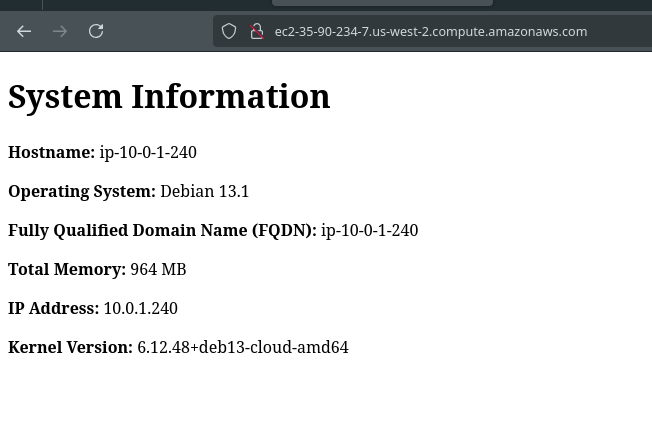

# intro-to-ansible-lab-files

Starter files for the intro to Ansible Lab, 4640.

Read lab instructions on D2L

By Ahmed, Hanan and Kevin

# Commands Used:
## Create new keys

This command uses ssh gey gen to create a new keypair to be used for this lab

<pre><b>user@Debian13</b>:<b>~/Documents/lab7/intro-to-ansible-lab-files</b>$ ssh-keygen -t ed25519 -f ~/.ssh/aws -C &quot;acit4640-lab7&quot;
Generating public/private ed25519 key pair.
Enter passphrase for &quot;/home/user/.ssh/aws&quot; (empty for no passphrase): 
Enter same passphrase again: 
Your identification has been saved in /home/user/.ssh/aws
Your public key has been saved in /home/user/.ssh/aws.pub
The key fingerprint is:
SHA256:26ysHuG10RZnX8W+0n2GdmsftBD2Hqo5ONRw17PB/Nk acit4640-lab7
The key&apos;s randomart image is:
+--[ED25519 256]--+
|               ..|
|                o|
|          . oo+..|
|         o =.ooB.|
|      . S * ..o=X|
|     . o O . .B=E|
|      o + +  o.*o|
|       o + .o  o.|
|     .o.o .o. . o|
+----[SHA256]-----+
</pre>

##   - run included scripts to import and delete keys

This uses the provided script to import said key into our AWS key storage

<pre><b>user@Debian13</b>:<b>~/Documents/lab7/intro-to-ansible-lab-files</b>$ 
./scripts/import_lab_key ~/.ssh/aws.pub
</pre>

## Teraform Commands Run:

I just ran init to inialize the directory. And then apply - auto-approve to run it in its entirity:

<pre><b>user@Debian13</b>:<b>~/Documents/lab7/intro-to-ansible-lab-files</b>$ cd terraform
terraform init
terraform apply -auto-approve
<b>Initializing the backend...</b>
<b>Initializing provider plugins...</b>
- Finding hashicorp/aws versions matching &quot;~&gt; 6.16&quot;...
- Installing hashicorp/aws v6.17.0...
- Installed hashicorp/aws v6.17.0 (signed by HashiCorp)
Terraform has created a lock file <b>.terraform.lock.hcl</b> to record the provider
selections it made above. Include this file in your version control repository
so that Terraform can guarantee to make the same selections by default when
you run &quot;terraform init&quot; in the future.

<b>Terraform has been successfully initialized!</b>

You may now begin working with Terraform. Try running &quot;terraform plan&quot; to see
any changes that are required for your infrastructure. All Terraform commands
should now work.

If you ever set or change modules or backend configuration for Terraform,
rerun this command to reinitialize your working directory. If you forget, other
commands will detect it and remind you to do so if necessary.
<b>data.aws_ami.debian: Reading...</b>
<b>data.aws_ami.debian: Read complete after 1s [id=ami-081ac37fe26dacc98]</b>

Terraform used the selected providers to generate the following
execution plan. Resource actions are indicated with the following
symbols:
  + create

Terraform will perform the following actions:

<b>  # aws_instance.web[0]</b> will be created
  + resource &quot;aws_instance&quot; &quot;web&quot; {
      + ami                                  = &quot;ami-081ac37fe26dacc98&quot;
      + arn                                  = (known after apply)
      + associate_public_ip_address          = (known after apply)
      + availability_zone                    = (known after apply)
      + disable_api_stop                     = (known after apply)
      + disable_api_termination              = (known after apply)
      + ebs_optimized                        = (known after apply)
      + enable_primary_ipv6                  = (known after apply)
      + force_destroy                        = false
      + get_password_data                    = false
      + host_id                              = (known after apply)
      + host_resource_group_arn              = (known after apply)
      + iam_instance_profile                 = (known after apply)
      + id                                   = (known after apply)
      + instance_initiated_shutdown_behavior = (known after apply)
      + instance_lifecycle                   = (known after apply)
      + instance_state                       = (known after apply)
      + instance_type                        = &quot;t2.micro&quot;
      + ipv6_address_count                   = (known after apply)
      + ipv6_addresses                       = (known after apply)
      + key_name                             = &quot;4640-wk7-key&quot;
      + monitoring                           = (known after apply)
      + outpost_arn                          = (known after apply)
      + password_data                        = (known after apply)
      + placement_group                      = (known after apply)
      + placement_group_id                   = (known after apply)
      + placement_partition_number           = (known after apply)
      + primary_network_interface_id         = (known after apply)
      + private_dns                          = (known after apply)
      + private_ip                           = (known after apply)
      + public_dns                           = (known after apply)
      + public_ip                            = (known after apply)
      + region                               = &quot;us-west-2&quot;
      + secondary_private_ips                = (known after apply)
      + security_groups                      = (known after apply)
      + source_dest_check                    = true
      + spot_instance_request_id             = (known after apply)
      + subnet_id                            = (known after apply)
      + tags                                 = {
          + &quot;Name&quot; = &quot;Web&quot;
        }
      + tags_all                             = {
          + &quot;Name&quot; = &quot;Web&quot;
        }
      + tenancy                              = (known after apply)
      + user_data_base64                     = (known after apply)
      + user_data_replace_on_change          = false
      + vpc_security_group_ids               = (known after apply)

      + capacity_reservation_specification (known after apply)

      + cpu_options (known after apply)

      + ebs_block_device (known after apply)

      + enclave_options (known after apply)

      + ephemeral_block_device (known after apply)

      + instance_market_options (known after apply)

      + maintenance_options (known after apply)

      + metadata_options (known after apply)

      + network_interface (known after apply)

      + primary_network_interface (known after apply)

      + private_dns_name_options (known after apply)

      + root_block_device (known after apply)
    }

<b>  # aws_instance.web[1]</b> will be created
  + resource &quot;aws_instance&quot; &quot;web&quot; {
      + ami                                  = &quot;ami-081ac37fe26dacc98&quot;
      + arn                                  = (known after apply)
      + associate_public_ip_address          = (known after apply)
      + availability_zone                    = (known after apply)
      + disable_api_stop                     = (known after apply)
      + disable_api_termination              = (known after apply)
      + ebs_optimized                        = (known after apply)
      + enable_primary_ipv6                  = (known after apply)
      + force_destroy                        = false
      + get_password_data                    = false
      + host_id                              = (known after apply)
      + host_resource_group_arn              = (known after apply)
      + iam_instance_profile                 = (known after apply)
      + id                                   = (known after apply)
      + instance_initiated_shutdown_behavior = (known after apply)
      + instance_lifecycle                   = (known after apply)
      + instance_state                       = (known after apply)
      + instance_type                        = &quot;t2.micro&quot;
      + ipv6_address_count                   = (known after apply)
      + ipv6_addresses                       = (known after apply)
      + key_name                             = &quot;4640-wk7-key&quot;
      + monitoring                           = (known after apply)
      + outpost_arn                          = (known after apply)
      + password_data                        = (known after apply)
      + placement_group                      = (known after apply)
      + placement_group_id                   = (known after apply)
      + placement_partition_number           = (known after apply)
      + primary_network_interface_id         = (known after apply)
      + private_dns                          = (known after apply)
      + private_ip                           = (known after apply)
      + public_dns                           = (known after apply)
      + public_ip                            = (known after apply)
      + region                               = &quot;us-west-2&quot;
      + secondary_private_ips                = (known after apply)
      + security_groups                      = (known after apply)
      + source_dest_check                    = true
      + spot_instance_request_id             = (known after apply)
      + subnet_id                            = (known after apply)
      + tags                                 = {
          + &quot;Name&quot; = &quot;Web&quot;
        }
      + tags_all                             = {
          + &quot;Name&quot; = &quot;Web&quot;
        }
      + tenancy                              = (known after apply)
      + user_data_base64                     = (known after apply)
      + user_data_replace_on_change          = false
      + vpc_security_group_ids               = (known after apply)

      + capacity_reservation_specification (known after apply)

      + cpu_options (known after apply)

      + ebs_block_device (known after apply)

      + enclave_options (known after apply)

      + ephemeral_block_device (known after apply)

      + instance_market_options (known after apply)

      + maintenance_options (known after apply)

      + metadata_options (known after apply)

      + network_interface (known after apply)

      + primary_network_interface (known after apply)

      + private_dns_name_options (known after apply)

      + root_block_device (known after apply)
    }

<b>  # aws_internet_gateway.web-gw</b> will be created
  + resource &quot;aws_internet_gateway&quot; &quot;web-gw&quot; {
      + arn      = (known after apply)
      + id       = (known after apply)
      + owner_id = (known after apply)
      + region   = &quot;us-west-2&quot;
      + tags     = {
          + &quot;Name&quot; = &quot;Web&quot;
        }
      + tags_all = {
          + &quot;Name&quot; = &quot;Web&quot;
        }
      + vpc_id   = (known after apply)
    }

<b>  # aws_route.default_route</b> will be created
  + resource &quot;aws_route&quot; &quot;default_route&quot; {
      + destination_cidr_block = &quot;0.0.0.0/0&quot;
      + gateway_id             = (known after apply)
      + id                     = (known after apply)
      + instance_id            = (known after apply)
      + instance_owner_id      = (known after apply)
      + network_interface_id   = (known after apply)
      + origin                 = (known after apply)
      + region                 = &quot;us-west-2&quot;
      + route_table_id         = (known after apply)
      + state                  = (known after apply)
    }

<b>  # aws_route_table.web</b> will be created
  + resource &quot;aws_route_table&quot; &quot;web&quot; {
      + arn              = (known after apply)
      + id               = (known after apply)
      + owner_id         = (known after apply)
      + propagating_vgws = (known after apply)
      + region           = &quot;us-west-2&quot;
      + route            = (known after apply)
      + tags             = {
          + &quot;Name&quot; = &quot;web-route&quot;
        }
      + tags_all         = {
          + &quot;Name&quot; = &quot;web-route&quot;
        }
      + vpc_id           = (known after apply)
    }

<b>  # aws_route_table_association.web</b> will be created
  + resource &quot;aws_route_table_association&quot; &quot;web&quot; {
      + id             = (known after apply)
      + region         = &quot;us-west-2&quot;
      + route_table_id = (known after apply)
      + subnet_id      = (known after apply)
    }

<b>  # aws_security_group.web</b> will be created
  + resource &quot;aws_security_group&quot; &quot;web&quot; {
      + arn                    = (known after apply)
      + description            = &quot;allow ssh from home and work&quot;
      + egress                 = (known after apply)
      + id                     = (known after apply)
      + ingress                = (known after apply)
      + name                   = &quot;allow_ssh&quot;
      + name_prefix            = (known after apply)
      + owner_id               = (known after apply)
      + region                 = &quot;us-west-2&quot;
      + revoke_rules_on_delete = false
      + tags                   = {
          + &quot;Name&quot; = &quot;Web&quot;
        }
      + tags_all               = {
          + &quot;Name&quot; = &quot;Web&quot;
        }
      + vpc_id                 = (known after apply)
    }

<b>  # aws_subnet.web</b> will be created
  + resource &quot;aws_subnet&quot; &quot;web&quot; {
      + arn                                            = (known after apply)
      + assign_ipv6_address_on_creation                = false
      + availability_zone                              = &quot;us-west-2a&quot;
      + availability_zone_id                           = (known after apply)
      + cidr_block                                     = &quot;10.0.1.0/24&quot;
      + enable_dns64                                   = false
      + enable_resource_name_dns_a_record_on_launch    = false
      + enable_resource_name_dns_aaaa_record_on_launch = false
      + id                                             = (known after apply)
      + ipv6_cidr_block_association_id                 = (known after apply)
      + ipv6_native                                    = false
      + map_public_ip_on_launch                        = true
      + owner_id                                       = (known after apply)
      + private_dns_hostname_type_on_launch            = (known after apply)
      + region                                         = &quot;us-west-2&quot;
      + tags                                           = {
          + &quot;Name&quot; = &quot;Web&quot;
        }
      + tags_all                                       = {
          + &quot;Name&quot; = &quot;Web&quot;
        }
      + vpc_id                                         = (known after apply)
    }

<b>  # aws_vpc.web</b> will be created
  + resource &quot;aws_vpc&quot; &quot;web&quot; {
      + arn                                  = (known after apply)
      + cidr_block                           = &quot;10.0.0.0/16&quot;
      + default_network_acl_id               = (known after apply)
      + default_route_table_id               = (known after apply)
      + default_security_group_id            = (known after apply)
      + dhcp_options_id                      = (known after apply)
      + enable_dns_hostnames                 = true
      + enable_dns_support                   = true
      + enable_network_address_usage_metrics = (known after apply)
      + id                                   = (known after apply)
      + instance_tenancy                     = &quot;default&quot;
      + ipv6_association_id                  = (known after apply)
      + ipv6_cidr_block                      = (known after apply)
      + ipv6_cidr_block_network_border_group = (known after apply)
      + main_route_table_id                  = (known after apply)
      + owner_id                             = (known after apply)
      + region                               = &quot;us-west-2&quot;
      + tags                                 = {
          + &quot;Name&quot;    = &quot;project_vpc&quot;
          + &quot;Project&quot; = &quot;lab_week_4&quot;
        }
      + tags_all                             = {
          + &quot;Name&quot;    = &quot;project_vpc&quot;
          + &quot;Project&quot; = &quot;lab_week_4&quot;
        }
    }

<b>  # aws_vpc_security_group_egress_rule.web-egress</b> will be created
  + resource &quot;aws_vpc_security_group_egress_rule&quot; &quot;web-egress&quot; {
      + arn                    = (known after apply)
      + cidr_ipv4              = &quot;0.0.0.0/0&quot;
      + id                     = (known after apply)
      + ip_protocol            = &quot;-1&quot;
      + region                 = &quot;us-west-2&quot;
      + security_group_id      = (known after apply)
      + security_group_rule_id = (known after apply)
      + tags_all               = {}
    }

<b>  # aws_vpc_security_group_ingress_rule.web-http</b> will be created
  + resource &quot;aws_vpc_security_group_ingress_rule&quot; &quot;web-http&quot; {
      + arn                    = (known after apply)
      + cidr_ipv4              = &quot;0.0.0.0/0&quot;
      + from_port              = 80
      + id                     = (known after apply)
      + ip_protocol            = &quot;tcp&quot;
      + region                 = &quot;us-west-2&quot;
      + security_group_id      = (known after apply)
      + security_group_rule_id = (known after apply)
      + tags_all               = {}
      + to_port                = 80
    }

<b>  # aws_vpc_security_group_ingress_rule.web-ssh</b> will be created
  + resource &quot;aws_vpc_security_group_ingress_rule&quot; &quot;web-ssh&quot; {
      + arn                    = (known after apply)
      + cidr_ipv4              = &quot;0.0.0.0/0&quot;
      + from_port              = 22
      + id                     = (known after apply)
      + ip_protocol            = &quot;tcp&quot;
      + region                 = &quot;us-west-2&quot;
      + security_group_id      = (known after apply)
      + security_group_rule_id = (known after apply)
      + tags_all               = {}
      + to_port                = 22
    }

<b>Plan:</b> 12 to add, 0 to change, 0 to destroy.

Changes to Outputs:
  + instance_ip_addr = {
      + dns_name    = (known after apply)
      + dns_name-2  = (known after apply)
      + public_ip   = (known after apply)
      + public_ip-2 = (known after apply)
    }
<b>aws_vpc.web: Creating...</b>
<b>aws_vpc.web: Still creating... [00m10s elapsed]</b>
<b>aws_vpc.web: Creation complete after 12s [id=vpc-0822ba529c654f5c2]</b>
<b>aws_internet_gateway.web-gw: Creating...</b>
<b>aws_route_table.web: Creating...</b>
<b>aws_subnet.web: Creating...</b>
<b>aws_security_group.web: Creating...</b>
<b>aws_route_table.web: Creation complete after 1s [id=rtb-04ee4a9c225f8b8d1]</b>
<b>aws_internet_gateway.web-gw: Creation complete after 1s [id=igw-04bce5e0ab1ac2c4d]</b>
<b>aws_route.default_route: Creating...</b>
<b>aws_route.default_route: Creation complete after 0s [id=r-rtb-04ee4a9c225f8b8d11080289494]</b>
<b>aws_security_group.web: Creation complete after 2s [id=sg-029167309b4e4018e]</b>
<b>aws_vpc_security_group_ingress_rule.web-http: Creating...</b>
<b>aws_vpc_security_group_egress_rule.web-egress: Creating...</b>
<b>aws_vpc_security_group_ingress_rule.web-ssh: Creating...</b>
<b>aws_vpc_security_group_ingress_rule.web-ssh: Creation complete after 0s [id=sgr-09790e6020472f40f]</b>
<b>aws_vpc_security_group_egress_rule.web-egress: Creation complete after 0s [id=sgr-0931ca4099b6c35a4]</b>
<b>aws_vpc_security_group_ingress_rule.web-http: Creation complete after 0s [id=sgr-0f89a57a5bb586899]</b>
<b>aws_subnet.web: Still creating... [00m10s elapsed]</b>
<b>aws_subnet.web: Creation complete after 11s [id=subnet-0de6cb9f2f900b246]</b>
<b>aws_route_table_association.web: Creating...</b>
<b>aws_instance.web[0]: Creating...</b>
<b>aws_instance.web[1]: Creating...</b>
<b>aws_route_table_association.web: Creation complete after 1s [id=rtbassoc-0be3afbebf1f5af50]</b>
<b>aws_instance.web[0]: Still creating... [00m10s elapsed]</b>
<b>aws_instance.web[1]: Still creating... [00m10s elapsed]</b>
<b>aws_instance.web[0]: Creation complete after 13s [id=i-020e7a761cafa3ac2]</b>
<b>aws_instance.web[1]: Creation complete after 13s [id=i-02a411fb5a47804fb]</b>

<b>Apply complete! Resources: 12 added, 0 changed, 0 destroyed.</b>

<b>Outputs:</b>

instance_ip_addr = {
  &quot;dns_name&quot; = &quot;ec2-35-90-234-7.us-west-2.compute.amazonaws.com&quot;
  &quot;dns_name-2&quot; = &quot;ec2-52-10-19-104.us-west-2.compute.amazonaws.com&quot;
  &quot;public_ip&quot; = &quot;35.90.234.7&quot;
  &quot;public_ip-2&quot; = &quot;52.10.19.104&quot;
}
</pre>

## Ansible Commands:

Update your anisble hosts with the info from the terraform outputs and update the ansible playbook yml to complete the tasks. Then run this command to run anisble:

<pre><b>user@Debian13</b>:<b>~/Documents/lab7/intro-to-ansible-lab-files/ansible</b>$ ansible-playbook playbook.yml

PLAY [Configure web servers] ***************************************************

TASK [Gathering Facts] *********************************************************
<b>[WARNING]: Host &apos;server-two&apos; is using the discovered Python interpreter at &apos;/usr/bin/python3.13&apos;, but future installation of another Python interpreter could cause a different interpreter to be discovered. See https://docs.ansible.com/ansible-core/devel/reference_appendices/interpreter_discovery.html for more information.</b>
ok: [server-two]
<b>[WARNING]: Host &apos;server-one&apos; is using the discovered Python interpreter at &apos;/usr/bin/python3.13&apos;, but future installation of another Python interpreter could cause a different interpreter to be discovered. See https://docs.ansible.com/ansible-core/devel/reference_appendices/interpreter_discovery.html for more information.</b>
ok: [server-one]

TASK [Install nginx] ***********************************************************
ok: [server-one]
ok: [server-two]

TASK [create directory structure for web documents] ****************************
ok: [server-two]
ok: [server-one]

TASK [copy nginx conf file to server] ******************************************
ok: [server-two]
ok: [server-one]

TASK [create link to nginx config file to enable it] ***************************
ok: [server-two]
ok: [server-one]

TASK [Generate index.html file from template] **********************************
ok: [server-one]
ok: [server-two]

TASK [reload and enable nginx service] *****************************************
changed: [server-two]
changed: [server-one]

PLAY RECAP *********************************************************************
server-one                 : ok=7    changed=1    unreachable=0    failed=0    skipped=0    rescued=0    ignored=0   
server-two                 : ok=7    changed=1    unreachable=0    failed=0    skipped=0    rescued=0    ignored=0   

</pre>

## Screenshot of rendered HTML Page

